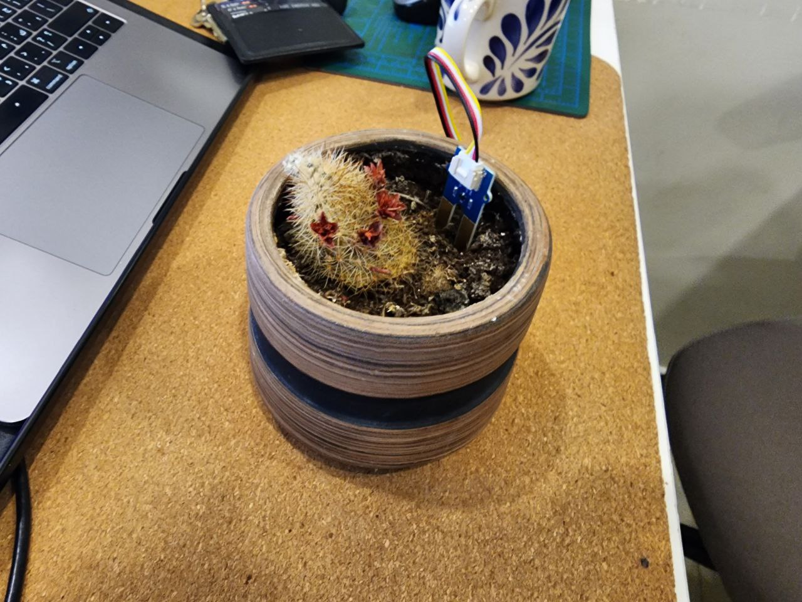
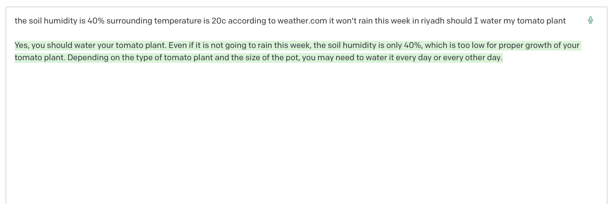
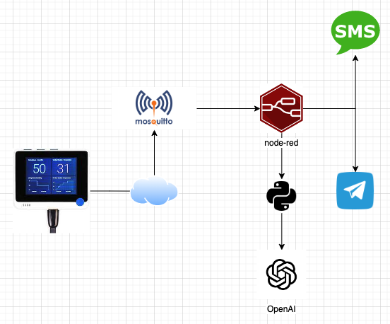

# redhot_chatGPT
 
A solution that uses openAI and IoT to monitor plant soil humidity

I have the tendency to kill plants by either over or underwatering them so I thought i might use chatGPT to help me with it

## Prerequisites

1. Node Red Server
2. Mosquitto MQTT server
3. Soil Humidity Sensor
4. openAI API key

##Architecture

Here is the flow  

## Payload
The payload should look like this 

`
{
"plant": "parsley",
"humidity": 40
}
`